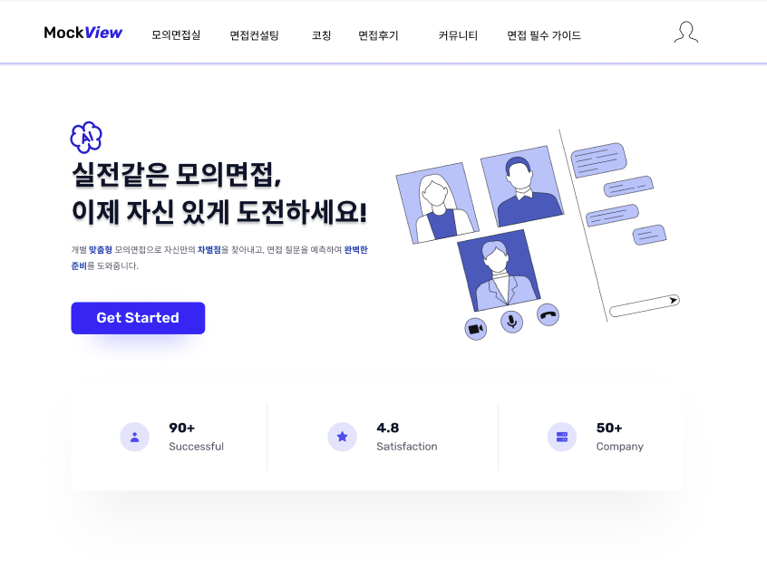

# 🌟 Portfolio Website



> **양혜원 | Frontend Developer**  
> 사용자 경험 중심의 UI/UX와 확장 가능한 서비스를 만드는 주니어 개발자입니다.

---

## 📖 소개
이 프로젝트는 저의 개인 포트폴리오 웹사이트입니다.  
주요 프로젝트, 기술 스택, 그리고 연락처를 한눈에 볼 수 있도록 구성했습니다.

---

## ✨ 주요 섹션
- 🧑‍💻 **About Me** – 간단한 자기소개와 개발 철학
- 📂 **Projects** – 실제 진행했던 프로젝트와 보러가기 버튼
- 🛠 **Skills & Stats** – 사용 가능한 기술 스택과 도구
- 📬 **Contact Me** – 이메일 모달, GitHub & 블로그 링크

---

## 🛠 사용 기술
| Frontend | Design | Collaboration |
|---------|--------|---------------|
| **React**, TailwindCSS, Vanilla JS, HTML5, CSS3 | Figma | Git, GitHub, Notion |

---

## 🚀 시작하기
이 포트폴리오를 로컬에서 실행하려면 다음 단계를 따라주세요.

```bash
# 1. 프로젝트 클론
git clone https://github.com/Yanghewon/Portfolio.git

# 2. 프로젝트 폴더로 이동
cd Portfolio

# 3. index.html 실행 (브라우저에서 열기)
open index.html
